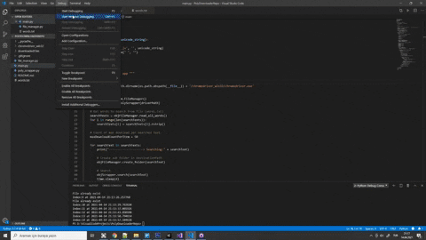

# PolyDownloader
A webscrapper for Poly Google website (poly.google.com). I created this project to download poly.google.com library for predetermined search words. App search all texts in words.txt file one by one. Downloads founded 3d items (OBJ format) and moves them in 'downloadedFiles' folder.
* Project written in python(v3.7.4) and uses selenium. 
* Also it uses Google Chrome as webbrowser. Google chrome web driver is included in project but you might have to change it according to your current chrome version. You can get it from: https://chromedriver.chromium.org/   
* Download folder is default windows download location which something like 'C:\Users\UserMachine\Downloads'. Otherwise you have change path variable(downloadsPath) from file_manager.py file.

You can read the tutorial about it from : https://cihaddogan.medium.com/a-web-scrapper-with-python-and-selenium-for-poly-google-com-2ae5cf30b743

Example automated working :

